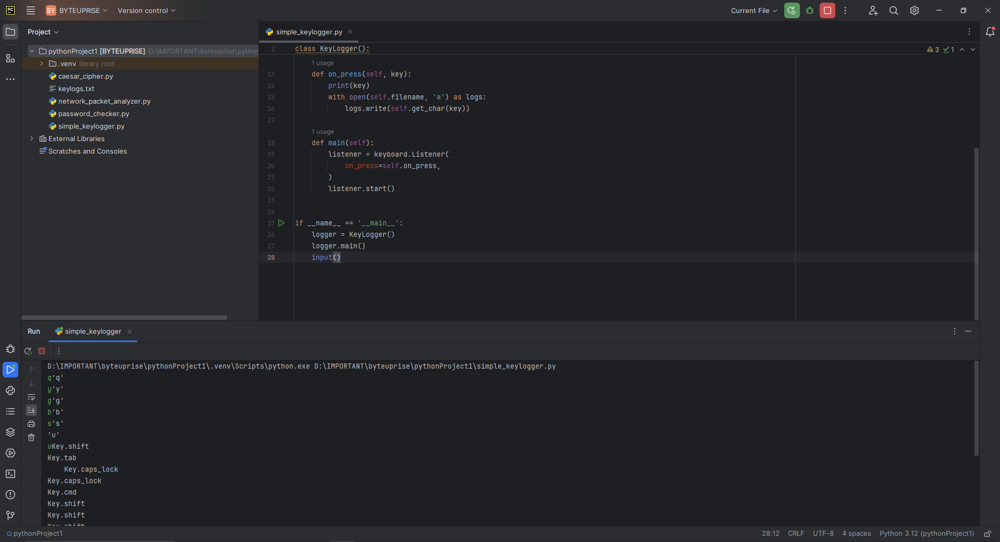

# ByteUprise_task2_CyberSecurity

Excited to unveil my latest project! I've created a basic keylogger program that records keystrokes, emphasizing ethical considerations and permissions. Your security matters!

# About Simple Keylogger

Keylogger programs quietly record keystrokes made on a device, capturing sensitive information like passwords and messages without the user's knowledge. They operate covertly, often transmitting the logged data to remote servers for malicious use. Despite some legitimate applications, such as parental controls or employee monitoring, keyloggers are primarily associated with unauthorized surveillance and data theft. Protecting against keylogger attacks requires robust cybersecurity measures and vigilance.

# Code
This is the code which i came up with using python [Code](simple_keylogger.py).

# Output

- Video
If the video does play its in [Here](Media/keylogger.mp4).

<video controls src="Media/keylogger.mp4" title="keylogger"></video>

- Photo

